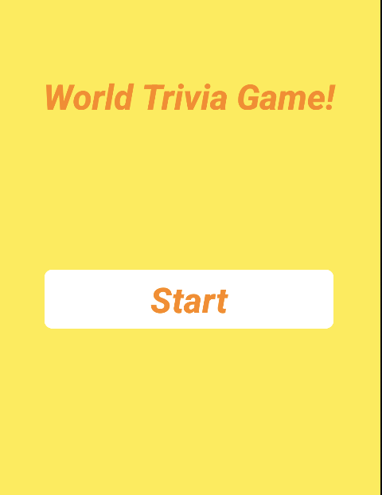

🌍 World Flag Trivia Game

Welcome to the World Flag Trivia Game! This Android app is designed to test your knowledge of flags from around the world. Developed in Kotlin and Java, this app offers a fun and interactive way to improve your geography skills.

📱 Screenshots

### Home Screen

### Game Screens
 
 

### Result Screen

🚀 Features

	*  Multiple-choice questions to guess the correct flag
	*  Score tracking to monitor your progress
	*  Hints to help when you’re stuck
	*  Results screen to display your final score and performance
	*  Intuitive and interactive UI

🛠️ Technologies Used

	*  Kotlin + Java: Core programming languages for the app
	*  Android Studio: IDE used for development
	*  Android Jetpack Components: ViewModel, LiveData, and Navigation

 📲 Installation

1. Clone this repository
2. Open the project in Android Studio
3. Build and Run
   - Sync the Gradle files and run the app on an emulator or a physical device.
  

🧩 How to Play
1. Start the Quiz: Tap on “Start Quiz” to begin.
2. Answer Questions: For each question, select the country that corresponds to the displayed flag.
3. Track Your Score: After each question, see if you got it right! Your score is updated in real-time.
4. View Results: At the end of the quiz, view your final score in a chart format.

### 📄 Code Structure

Here's a quick overview of the main files and directories in the project:

- **`com.sfanuz.worldflagtrivia`**
  - `database/`
    - `DatabaseCopyHelper`: Handles copying the database from assets to internal storage.
    - `FlagsDao`: Interface for accessing flag data in the database.
  - `model/`
    - `FlagsModel`: Data model for representing flag information.
  - `view/`
    - `FragmentHome`: Displays the home screen of the app.
    - `FragmentQuiz`: Handles the quiz questions and user interactions.
    - `FragmentResult`: Displays the final score and performance breakdown.
    - `MainActivity`: The main entry point for the app.

- **`assets/`**
  - `Countries.db`: Database containing flag data for the quiz.

- **`res/`**
  - `drawable/`: Contains image resources.
  - `layout/`: XML files for defining UI layouts.
  - `mipmap/`: Launcher icons.
  - `navigation/`: Navigation graph for handling fragment transitions.
  - `values/`: Holds XML resource files such as `strings.xml` and `colors.xml`.
  - `xml/`: Miscellaneous XML files, possibly for configuration.

